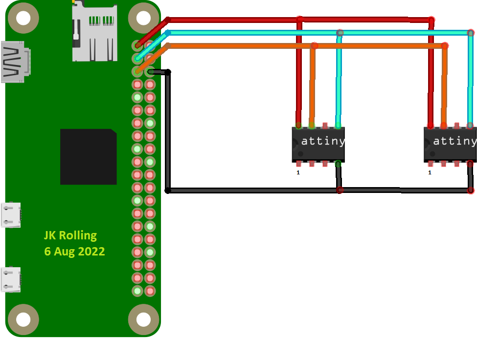
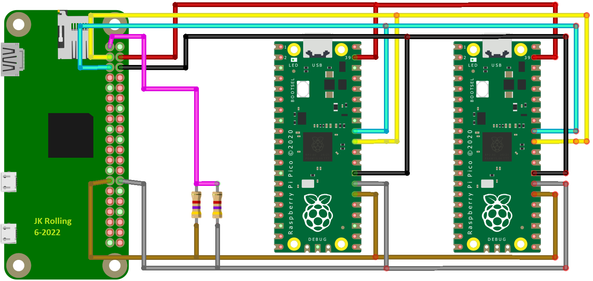
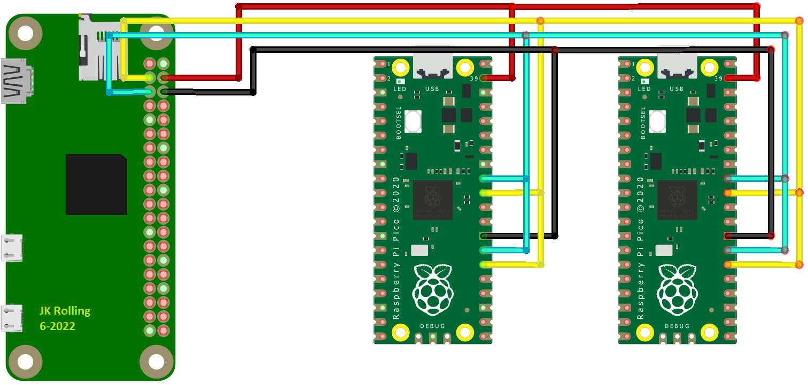

# DuinoCoinI2C_RPI
This project design to mine [Duino-Coin](https://github.com/revoxhere/duino-coin) using Raspberry Pi or equivalent SBC as a master and Arduino/ATtiny85 as a slave.

Using the I2C communication to connect all the boards and make a scalable communication between the master and the slaves.

## Video Tutorial

Raspberry Pi AVR I2C Bus 1 [tutorial video](https://youtu.be/bZ2XwPpYtiw)

Raspberry Pi AVR I2C Bus 0 [tutorial video](https://youtu.be/ywO7j4yqIlg)

Raspberry Pi Pico HW Part1 [tutorial video](https://youtu.be/yu4R4ktdubY)

Raspberry Pi Pico SW Part2 (coming soon)

## Python Environment Setup

### Linux

```BASH
sudo apt update
sudo apt install python3 python3-pip git i2c-tools python3-smbus screen -y # Install dependencies
git clone https://github.com/JK-Rolling/DuinoCoinI2C_RPI.git # Clone DuinoCoinI2C_RPI repository
cd DuinoCoinI2C_RPI
python3 -m pip install -r requirements.txt # Install pip dependencies
````

Use `sudo raspi-config` to enable I2C. Refer detailed steps at [raspberry-pi-i2c](https://pimylifeup.com/raspberry-pi-i2c/)

For RPI I2C Bus 0, extra step is needed, `sudo nano /boot/config.txt` and add `dtparam=i2c_vc=on`, save and reboot

For RPi Pico as worker, the RPi master is strongly recomended to use 400kHz/1MHz SCL clock frequency. again, `sudo nano /boot/config.txt`,
 add `dtparam=i2c_baudrate=1000000` and `dtparam=i2c_vc_baudrate=1000000` for 1MHz. Change to 400000 if you prefer 400kHz SCL.

Finally, connect your I2C AVR miner and launch the software (e.g. `python3 ./AVR_Miner_RPI.py`)

### Windows

1. Download and install [Python 3](https://www.python.org/downloads/) (add Python and Pip to Windows PATH)
2. Download [the DuinoCoinI2C_RPI](https://github.com/JK-Rolling/DuinoCoinI2C_RPI/releases)
3. Extract the zip archive you've downloaded and open the folder in command prompt
4. In command prompt type `py -m pip install -r requirements.txt` to install required pip dependencies

Finally, connect your I2C AVR miner and launch the software (e.g. `python3 ./AVR_Miner_RPI.py` or `py AVR_Miner_RPI.py` in the command prompt)

## Version

DuinoCoinI2C_RPI Version 3.18

# Arduino - Slave

Arduino shall use `DuinoCoin_RPI_Tiny_Slave` sketch. LLC is required if Arduino is operating at 5V and master at 3.3V. Arduino also have builtin temperature sensor that can be used for IoT reporting. This feature is enabled for fun as the ADC is uncalibrated. Once calibrated, the temperature can be pretty accurate according to some. Set `TEMPERATURE_OFFSET` and `FILTER_LP` to calibrate.

Occasionally slaves might hang and not responding to master. quick workaround is to press the reset button on the slave to bring it back.

Once in a blue moon, one of the slave might pull down the whole bus with it. power cycling the rig is the fastest way to bring it back.

To solve these issues permanently, update Nano with Optiboot bootloader. WDT will auto reset the board if there is no activity within 8s.

Change this line to `true` to activate the WDT. works for Nano clone as well. **make sure the Nano is using Optiboot**

`#define WDT_EN true`

feature can be turn on/off individually to cater for your specific scenario. set to false to disable.
```C
#define I2CS_FIND_ADDR false
#define WDT_EN true
#define CRC8_EN true
#define LED_EN true
#define SENSOR_EN true
```
|`#define`| Note |
|:-| :---- |
|DEV_INDEX|device index to help assign I2C address|
|I2CS_START_ADDRESS|this and `DEV_INDEX` summation will produce final I2C address|
|I2CS_FIND_ADDR|Scan available I2CS address and self-assign, overriding `DEV_INDEX`. Recommend to set `false`|
|WDT_EN|Auto self-reset every 8s in case of inactivity|
|CRC8_EN|I2C CRC8 insertion and data integrity checks|
|LED_EN|Blink when share is found|
|SENSOR_EN|Report chip internal temperature in degree Celsius|

each SBC have different starting I2CS address from `i2cdetect` command. Address that is not shown is still usable. To change the I2CS starting address, modify `I2CS_START_ADDRESS`

For disabled `I2CS_FIND_ADDR`, manually assign I2CS address by updating `DEV_INDEX`. `I2CS_FIND_ADDR` is best effort basis, it may or may not work.

# ATtiny85 - Slave

Use `DuinoCoin_ATTiny_Slave` for ATtiny. LLC is required if worker and host is operating at different voltage. 4k7 pullup resistors for `SDA/SCL` pins are strongly recommended if host do not have it built-in. The TWI/I2C/IIC seems to work well with SCL 100KHz `WIRE_CLOCK 100000`. Default compiled sketch size for ATtiny85 is 5630 bytes for program storage space and 351 bytes for dynamic memory. Estimated hashrate 267H/s for ATTiny85-20PU running at 3.3V or 5V. ATTiny85 also have builtin temperature sensor that can be used for IoT reporting. This feature is enabled for fun as the ADC is uncalibrated. Once calibrated, the temperature can be pretty accurate according to some. Set `TEMPERATURE_OFFSET` and `TEMPERATURE_COEFF` to calibrate. Note: floating point is costly, only proceed if you know what you're doing.

add `http://drazzy.com/package_drazzy.com_index.json` to `Additional Board Manager URLs` in Arduino IDE, then go to board manager and search for `attiny` and install ATTinyCore from Spence Konde

ATTiny85 for example, the system clock is default at 1MHz. This needs to be changed to get good hashrate

You may use dedicated ATTiny programmer or any Uno/Nano to set the fuse via `Tools --> Burn Bootloader`. See table below on setting that worked for me on ATtiny85. Finally upload sketch using `Sketch --> Upload Using Programmer`

|Attribute|Value|
|:-|:-|
|Board|ATtiny25/45/85 (No Bootloader)|
|Chip|ATtiny85|
|Clock Source|16.5 MHz (PLL,tweaked)|
|Timer 1 Clock|CPU|
|LTO|Enabled|
|millis()/micros()|Enabled|
|Save EEPROM|EEPROM retained|
|B.O.D Level|Disabled|

## ATTiny85 Wiring



## Reducing sketch / RAM usage
For some smaller devices, to get smallest possible sketch size without hacking, set `CRC8_EN false`, `WDT_EN false`, `SENSOR_EN false` and change to `#pragma GCC optimize ("-Os")` for all files. You should get 4232 bytes use of program storage space and 343 bytes of dynamic memory, which produce about 222H/s at 16MHz

to get smallest possible sketch size with hacking, use the above settings and hack file `Arduino15\packages\ATTinyCore\hardware\avr\1.5.2\libraries\Wire\src\USI_TWI_Slave\USI_TWI_Slave.h`. This should further reduce the dynamic memory usage to 319 bytes. *RELIABILITY NOT GUARANTEED*

```C
// change value from 16 to 4. somehow value of 1/2 broke TWI
#define TWI_RX_BUFFER_SIZE (4)
#define TWI_TX_BUFFER_SIZE (4)
```

# Raspberry Pi Pico - Slave

Use Pico dual core code for Raspberry Pi Pico. Logic Level Converter (LLC) is not required as both RPi and Pico operates at 3.3V.

Read `kdb.ino` for detailed setup steps in Arduino IDE

## RP2040 board package from Earle F. Philhower, III

For good out-of-box experience, add `https://github.com/earlephilhower/arduino-pico/releases/download/global/package_rp2040_index.json` to `Additional Board Manager URLs` in Arduino IDE, then search for RP2040 Boards **version 2.2.1 or above**. Install it from Arduino IDE board manager

Default I2C pin `SDA0 - GP20` `SCL0 - GP21` `SDA1 - GP26` `SCL1 - GP27`


## Relocating I2C pins

User can change the I2C pin by modifying pin value in `DuinoCoin_RPI_Pico_DualCore.ino`

`#define I2C0_SDA                    20`
`#define I2C0_SCL                    21`
`#define I2C1_SDA                    26`
`#define I2C1_SCL                    27`

The motivation to change the default I2C pin is to make the board rig building friendly because now the I2C pin have the same side as the `Vsys` pin

## Library Dependency

* [ArduinoUniqueID](https://github.com/ricaun/ArduinoUniqueID) (Handle the chip ID)
* [StreamString](https://github.com/ricaun/StreamJoin)

## I2C Address 

The I2C Address on the Arduino is hardcoded by user. if an address already exists on the I2C bus, the behavior is undefined

Change the value on the define for each worker for unique address:
```
#define DEV_INDEX 1
```

# Raspberry PI or SBC - Master

The master requests the job on the `DuinoCoin` server and sends the work to the slave (Arduino).

After the job is done, the slave sends back the response to the master (SBC) and then sends back to the `DuinoCoin` server.

## IoT Feature

RPi Pico have built in temperature sensor that made IoT reporting possible.

For other worker, it is possible to add external sensor and enhance worker sketch to read them. But it is outside of the scope.

## CRC8 Feature

During setup, Python will auto discover worker CRC8 status. This option applies to all workers.

CRC8 feature is ON by default. To disable it, use `#define CRC8_EN false`

## Max Client/Slave

The code theoretically supports up to 119 clients on Raspberry PI (Bullseye OS) on single I2C bus

Slave addresses range from 0x0..0x77

Some reported that I2C addresses that did not shows up from `i2cdetect` are accessible

RPi have 2 I2C buses which bring up the count up to 254 (theoretical). This requires 2 separate instances of Python miner with it's own Settings.cfg file. Duplicate the directory into 2 and start the setup from there. Instance 1 should use i2cbus 1 (RPi have builtin 1k8 pullup). Instance 2 should use i2cbus 0 (where external 4k7 pullup resistor are on)

## Enable I2C on Raspberry PI

Google or refer to [raspberry-pi-i2c](https://pimylifeup.com/raspberry-pi-i2c/)

For RPI I2C Bus 0, there might not be pull up resistor built in. It relies on the pull up from Nano.

For other I2C slave that do not have pull up capability, add 4k7 Ohm resistor to both SDA and SCL line on I2C bus 0.

**Note:** If you see bad shares, it could be due to a bug in [RPI I2C hardware](https://github.com/raspberrypi/linux/issues/254)

# Connection Pinouts

Connect the pins of the Raspberry PI on the Arduino like the table/images below, use a [Logic Level Converter](https://www.sparkfun.com/products/12009) to connect between the SBC and Arduino/ATtiny85

|| RPI | Logic Level Converter | Arduino |
|:-:| :----: | :-----: | :-----: |
||3.3V | <---> | 5V |
||GND | <---> | GND |
|`SDA`| PIN 3 | <---> | A4 |
|`SCL`| PIN 5 | <---> | A5 |

|| RPI | Logic Level Converter | ATtiny85 |
|:-:| :----: | :-----: | :-----: |
||3.3V | <---> | 5V |
||GND | <---> | GND |
|`SDA`| PIN 3 | <---> | PB0 |
|`SCL`| PIN 5 | <---> | PB2 |

## For dual I2C master and dual I2C slave interface



|| RPI (dual I2C) || Pico |
|:-:| :----: | :-----: | :-----: |
||3.3V or 5V | <---> | VSYS* |
||GND | <---> | GND |
|`SDA1`| PIN 3 | <---> | GP26 |
|`SCL1`| PIN 5 | <---> | GP27 |
|`SDA0`| PIN 27 | <---> | GP20 |
|`SCL0`| PIN 28 | <---> | GP21 |

## For single I2C master and dual I2C slave interface



|| RPI (single I2C) || Pico |
|:-:| :----: | :-----: | :-----: |
||3.3V or 5V | <---> | VSYS* |
||GND | <---> | GND |
|`SDA1`| PIN 3 | <---> | GP26, GP20 |
|`SCL1`| PIN 5 | <---> | GP27, GP21 |

\* VSYS accept voltage range from 1.8V to 5.5V. Voltage regulator onboard Pico will generate 3.3V for rp2040 use

## Benchmarks of tested devices

  | Device                                                    | Average hashrate<br>(all threads) | Mining<br>threads |
  |-----------------------------------------------------------|-----------------------------------|-------------------|
  | Arduino Pro Mini, Uno, Nano etc.<br>(Atmega 328p/pb/16u2) | 268 H/s                           | 1                 |
  | Adafruit Trinket 5V Attiny85                              | 258 H/s                           | 1                 |
  | Attiny85                                                  | 267 H/s                           | 1                 |
  | Raspberry Pi Pico                                         | 4.7 kH/s (100MHz)                 | 2                 |
  | Raspberry Pi Pico                                         | 5.4 kH/s (120MHz)                 | 2                 |

# License and Terms of service

All refers back to original [Duino-Coin licensee and terms of service](https://github.com/revoxhere/duino-coin)
